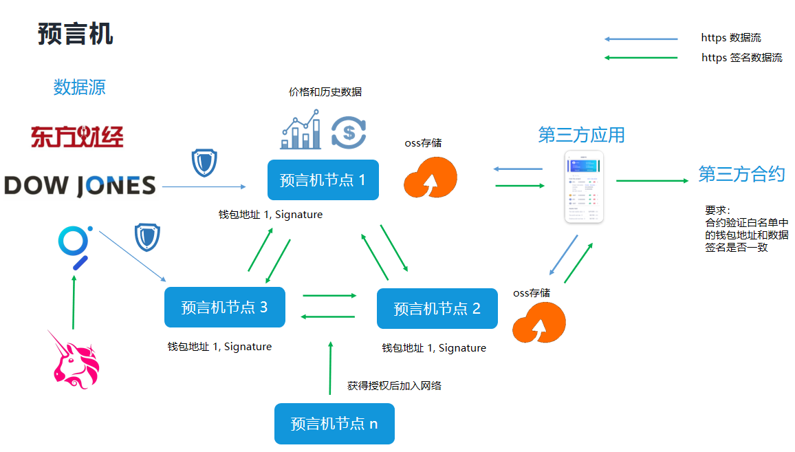

**系统架构图**

如图所示，整个系统分为四个部分：
- [数据源](dataSource.md)：我们的数据源基于coingecko　uniswap  twelvedata
- 预言机节点集群：节点集群负责从数据源获取数据，第三方应用有请求时，节点集体签名后，发送给第三方应用
- 第三方应用：主要通过从**oss存储**获取预言机价格数据，（oss数据源于预言机节点）．然后把数据提交给合约，合约验证白名单中的钱包地址和数据签名是否一致．