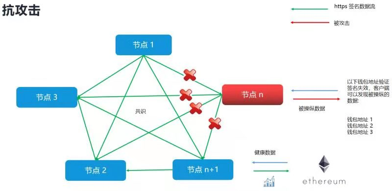

## 安全框架
- 通过任意节点访问价格数据时，所有节点都会参与这次数据访问，每个节点签名并返回自己的数据，每个节点参与最终结果的共识和计算。
- 节点间使用https做数据通讯。


## 签名验签
目前“签名算法”使用同ethereum－client－sdk发送交易时事件时相同的钱包椭圆曲线签名方式；solidity内置支持这种验签．
节点间的数据通讯/返回给第三方应用的数据/第三方应用返回给合约的数据，都使用这种签名算法。

这种验签规则不同于常规的私钥签名公钥验签。
它的server端验签逻辑**大致**是这样的： 
```js
returnAddre=verifySign(dataHash,signature);
return returnAddre==whiteList[returnAddre]
```
验证方法verifySign返回的eth地址，在白名单地址列表里，就表示有效的一签名．


对应的正式的**solidity**验签代码如下：
```js
// 获取币价换算接口 　/pub/coin_price/{coin}/{vs_coin}/{timestamp} 需要使用这种hash方式验签
 prefixedHash=keccak256(abi.encodePacked(Timestamp, TextPrice, Code)).toEthSignedMessageHash()
 prefixedHash.recover(sign)

//其它价格接口，略有差异：hash计算方式为abi.encode(object)
    struct Object {
        address token;
        uint256 price;
        uint256 timestamp;
    }
prefixedHash=keccak256(abi.encode(Object)).toEthSignedMessageHash()
prefixedHash.recover(sign)

```
附上的一段sol 验签 demo
```js
 function sync(bytes calldata data) internal returns (OP memory) {
        (bytes memory o, bytes[] memory s) = abi.decode(data, (bytes, bytes[]));
        OP memory op = abi.decode(o, (OP));
        if (op.timestamp <= timestamps[op.token]) {
            op.price = prices[op.token];
            op.timestamp = timestamps[op.token];
        } else {
            prices[op.token] = op.price;
            timestamps[op.token] = op.timestamp;
            require(s.length == SIGNATURENUM);
            bytes32 hash = keccak256(o).toEthSignedMessageHash();
            address auth = address(0);
            for (uint256 i = 0; i < s.length; i++) {
                address addr = hash.recover(s[i]);
                require(addr > auth);
                require(authorization[addr]);
                auth = addr;
            }
        }

        require(op.timestamp + EXPIRY > block.timestamp);
        return op;
    }
```
更多使用规则参考：　@openzeppelin/contracts-upgradeable/utils/cryptography/ECDSAUpgradeable.sol"

有签名的接口，一般为单字段价格数据接口：
- 美股价格股票接口
- uniswap token价格接口
- coin兑换价格接口
- any-api数据接口
- ftx价格接口

其它见swag文档

列表数据接口暂不使用签名，主要由于列表json太大，字段太多，无法在太合约里拼接hash，并验签．

## 签名流程
价格调用签名流程举例：
1. 节点1 收到价格api请求，它把价格请求发给其它所有节点。
1. 其它所有节点，把自己的价格数据和签名返回给“节点1”
1. “节点1”现在有了所有节点的“价格数据”列表及签名列表，它再次把这份“价格及签名列表”，发送其它的所有节点。
1. 所有节点使用这份“列表”，验签并计算“平均价格”，并再次签名返回给节点1；限制如下： 
   1. 当节点计算出的“平均价格”同自己的价格，有差异，并且差异大于千分之一时，节点不对计算出的平均价格签名；
   1. 当节点计算出的“平均价格”小于0.001时，也不签名。
1. 节点1把数据及签名返回给第三方调用。


## 价格签名数据结构
目前我们使用简单共识，当返回价格数据时，会包含所有节点数据的签名signs
大致结构，如下，不同的接口略有差异，详见swagger：
```js
{"price":123,
 "Signs":[
    {node:"node1",price:123,sign:node1_sign},
    {node:"node1",price:123,sign:node2_sign}
    ],
 "AvgSigns":[
    {node:"node1",price:123,sign:node1_sign},
    {node:"node1",price:123,sign:node2_sign}
    ]
}
```
字段说：
- Signs 每个节点本地存储的价格数据，这个列表＂可用＂于在第三方应用或是合约内部求平均价／取中位数等操作，或在合约内部完成价格共识
- AvgSigns 字段为各节点使＂Signs＂字段里的签名数据，各自计算的平均值．主要用于简化或是方便在合约开发．
- Price json最外层的price字段，为当前api调用节点的价格，主要用于方便现有页面app应用展现价格时，不用去取signs数据内容;可以忽略它，建议直接使用AvgSigns价格.

note:

当返回数据时signs字段列表的长度小于集群节点数量的　　(n/2)+1 时，返回失败．


## 节点钱包列表
http://62.234.169.68:8001/pub/stock/stats